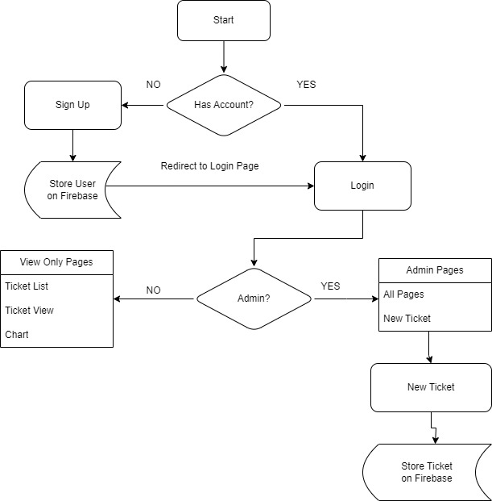

FlightTicketSchedulerApp,
  This project was generated with Angular CLI version 17.3.8.

Description:
- The Flight Ticket Scheduler App is an Angular application designed to manage and schedule flight tickets efficiently. It features role-based access, allowing both admin and user roles to interact with the system, view flight tickets, and access various functionalities. Admin users have additional privileges to add new tickets.

Features:
  1. Role-based access (Admin and User)
  2. View and filter flight tickets by type and other fields
  3. Search functionality across all ticket fields
  4. Admin-only ticket addition with UUID generation for ticket IDs
  5. Charts for ticket earnings and ticket types
  6. Styling with Bootstrap, MDB library and Angular Material
  7. Backend communication with Firebase
  8. Chart visualization using ng2-chart library

Installation Instructions
1. Clone the repository:
git clone https://github.com/malvina-14/flight-ticket-scheduler-app.git
2. Navigate to the project directory:
cd flight-ticket-scheduler-app
3. Install dependencies:
npm install
4. Start the development server:
ng serve
5. Navigate to http://localhost:4200/. The application will automatically reload if you change any of the source files.

Flow:

Usage:
- Login
   - Users can log in as either an admin or a user.
   - After logging in, the user is presented with a list of flight tickets.
- Viewing Flight Tickets
    - Both admin and user roles can view the flight tickets list.
    - Tickets can be filtered by type and searched by any other fields.
    - Adding Tickets (Admin Only)
    - Admin users can add new flight tickets.
    - Each new ticket is assigned a unique ID generated by UUID.
 - Viewing Charts
   - Both roles can view two types of charts:
   - Earnings of the tickets
   - Types of the tickets

 - Development
    - Code scaffolding
    - Run ng generate component component-name to generate a new component. You can also use ng generate directive|pipe|service|class|guard|interface|enum|module.

- Build
   - Run ng build to build the project. The build artifacts will be stored in the dist/ directory.

